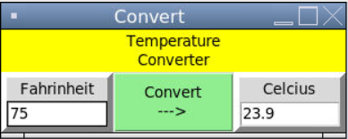

# Lab 31 - Temperature Converter

In this lab you will be using Tkinter and the Grid geometry manager to create an application that will convert temperatures from degrees F to degrees C.  Below is an example of what your converter could look like.  It does not have to look exactly like this.  Make it your own.  Make it better than this.

Here are the minimum requirements:

   - Use the grid geometry manager.  You may use pack along with using grid.
   - There must be more than one row and more than one column
   - You must have at least one widget that spans more than one row or more than one column (or both)
   - The user must be able to enter a temperature, press a button, and have the converted temperature displayed.
   - You must use at least one of Frame, Entry, Button, Label
   - Your application should have a title displayed in the window (not the window title)
   - Use color
   - Configure the rows and columns to be responsive to window resizing.

